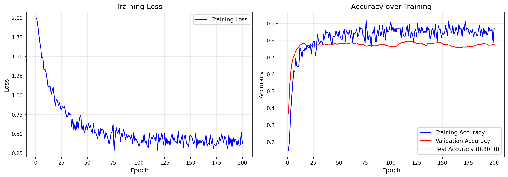
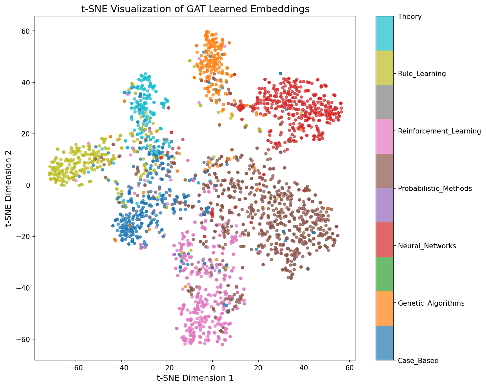

# Graph Attention Networks (GAT) for Node Classification

Implementation of the Graph Attention Network (GAT) from [Velickovic et al., 2018](https://arxiv.org/abs/1710.10903) for semi-supervised node classification on the Cora citation dataset, built with PyTorch Geometric.

## Architecture

GAT uses attention mechanisms on graphs where each node learns to weigh its neighbors differently based on their features:

1. A shared linear transformation is applied to every node
2. Attention coefficients are computed between each node and its neighbors using a learned attention vector + LeakyReLU
3. Coefficients are normalized with softmax, then used to compute a weighted sum of neighbor features
4. **Multi-head attention** runs K independent attention heads in parallel for stability

**Model architecture used:**

```
Input (1433 features)
  → GATConv Layer 1: 8 attention heads × 8 features = 64 features (concatenated)
  → ELU activation + Dropout (0.6)
  → GATConv Layer 2: 1 attention head × 7 features = 7 class logits
  → Log-Softmax
```

## Dataset

**Cora** is a citation network of scientific papers:

| Property | Value |
|----------|-------|
| Nodes (papers) | 2,708 |
| Edges (citations) | 5,429 |
| Features per node | 1,433 (bag-of-words) |
| Classes | 7 |
| Training nodes | 140 (20 per class) |
| Validation nodes | 500 |
| Test nodes | 1,000 |

The 7 classes are: Case_Based, Genetic_Algorithms, Neural_Networks, Probabilistic_Methods, Reinforcement_Learning, Rule_Learning, and Theory.

## Installation

```bash
git clone https://github.com/adiprathapa/graph-attention-networks.git
cd graph-attention-networks
python -m venv venv
source venv/bin/activate
pip install -r requirements.txt
```

## Usage

Open and run the notebook:

```bash
jupyter notebook notebooks/gat_cora.ipynb
```

Or open `notebooks/gat_cora.ipynb` in VSCode with the Jupyter extension.

The notebook will:
1. Download the Cora dataset (first run only)
2. Train the GAT model for 200 epochs
3. Evaluate on the test set
4. Generate training curves and t-SNE visualizations in `results/`

## Results

- **Test Accuracy:** ~80% (original paper reports ~83%)
- **Training:** 200 epochs, Adam optimizer (lr=0.005, weight_decay=5e-4)

### Training Curves


### t-SNE Embeddings


## References

- Velickovic, P., Cucurull, G., Casanova, A., Romero, A., Lio, P., & Bengio, Y. (2018). [Graph Attention Networks](https://arxiv.org/abs/1710.10903). ICLR 2018.
